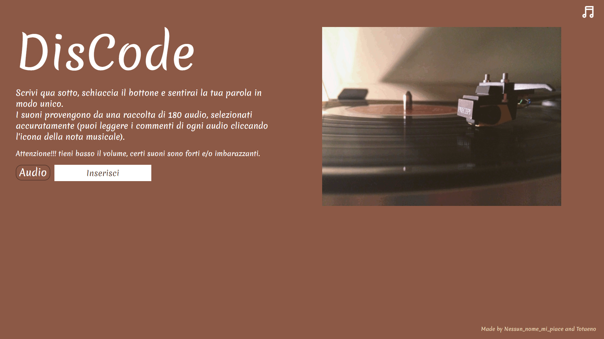

[![Contributors][contributors-shield]][contributors-url]
[![Github][github-shield]][github-url]
[![Organization][organization-shield]][organization-url]

  
  <h1 align="center">DisCode</h1>
  <h3 align="center"> Un sito che legge le parole in modo creativo </h3>
  

    ·
    <a href = "https://rodolfi-simone-zhan-sara.github.io">Sito</a>
    ·
    <a href="https://github.com/Rodolfi-Simone-Zhan-Sara/Rodolfi-Simone-Zhan-Sara.github.io/issues">Issue per bug e idee</a>
  

  
INDICE

  <ol>
    <li>
      <a href="#il-progetto">Il progetto</a>
      <ul>
        <li><a href="#realizzato-con">Realizzato con</a></li>
      </ul>
    </li>
    <li>
      <a href="#per-iniziare">Per iniziare</a>
    <li>
      <a href="#autori">Autori</a>
  </ol>

## Il progetto

 

Primavera. Era un giovedì mattina sereno, due ragazzi quindicenni dispersi per le vie e le strade di una grande città. Era imminente l'argomento per il compito estivo d'informatica...
Però, nessuna paura, avevano in mente tutto. Al parco, si sedettero rilassati su delle panchine, ad ascoltare le reciproche idee e finalmente decisero il progetto...
 
Svillupato in due mesi: dopo discussioni, fatiche e sudore. Consiste in una pagina web che riproduce parole con suoni divertenti, ma contemporaneamente riconducibili alle pronuncie dei caratteri stessi.
 
Ma non solo! In esclusiva anche la lista di descrizioni accurate, perché non vogliamo solo far divertire ma tentiamo di far conoscere queste piccole cose, piccoli suoni, che dovrebbero essere apprezzati di più~ 

  
### Realizzato con

* html
* css
* js

## Per iniziare

  Come prima cosa scarica la repository, sarà utile per la comprensione dei commenti ai vari audio.
   
  Due, cliccare la bellissima icona del giradischi qui sopra per aprire la pagina.
   
  Tre, pensa ad una parola/frase o soltanto lettere a caso, inseriscile, permi il bottone "Audio" e preparati all'ascolto(•ᴗ-).
   
  (Se la tua memoria è come la nostra ʘʚʘ non ti preoccupare troverai le istruzioni anche nel sito).
   
  Ultima comunicazione importante, ci sono degli Easter Egg quindi tocca a te scoprire il bottone che ti porta a tutte le parole magiche, troverai persino i nostri commenti a quegl'audio
   
  <h4>Ora tocca a te, divertiti, scopri e fatti grosse risate ꉂ◟(˃᷄ꇴ˂᷅)༡ʱªʱª✧ </h4>
  

## Autori

Ideato, progettato e realizzato da Simone Rodolfi (• . •)¿ & Sara Zhan (:◎)≡

<!-- MARKDOWN LINKS & IMAGES -->
[contributors-shield]: https://img.shields.io/badge/CONTRIBUTORS-%202-red
[contributors-url]: https://github.com/Rodolfi-Simone-Zhan-Sara/Rodolfi-Simone-Zhan-Sara.github.io/graphs/contributors
[github-shield]: https://img.shields.io/badge/GITHUB-%20REPOSITORY-orange
[github-url]: https://github.com/Rodolfi-Simone-Zhan-Sara/Rodolfi-Simone-Zhan-Sara.github.io
[organization-shield]: https://img.shields.io/badge/OUR-ORGANIZATION-yellow
[organization-url]: https://github.com/Rodolfi-Simone-Zhan-Sara
